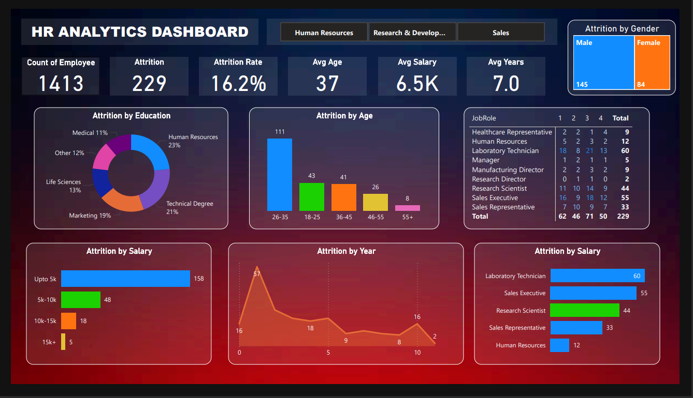

# HR Analytics Dashboard

## Overview
This Power BI dashboard analyzes key HR metrics, providing actionable insights for workforce management. The goal is to help organizations optimize employee retention, diversity, and performance.

## Features
- **Employee Turnover Analysis**
- **Diversity Metrics:** Gender, age breakdown.
- **Attrition Insights:** By education, salary, and year.
- **Job Role Breakdown:** Attrition trends by department.

## Tools Used
- **Power BI**: For interactive dashboard development.
- **Dataset**: [HR_Analytics.csv](HR_Analytics.csv)

## Preview

## Usage
1. Download the `.pbix` file (if uploaded later) and dataset.
2. Open the `.pbix` file in Power BI Desktop.
3. Replace the dataset path if required.

## Future Enhancements
- Add real-time data integration.
- Predictive analytics for attrition trends.
